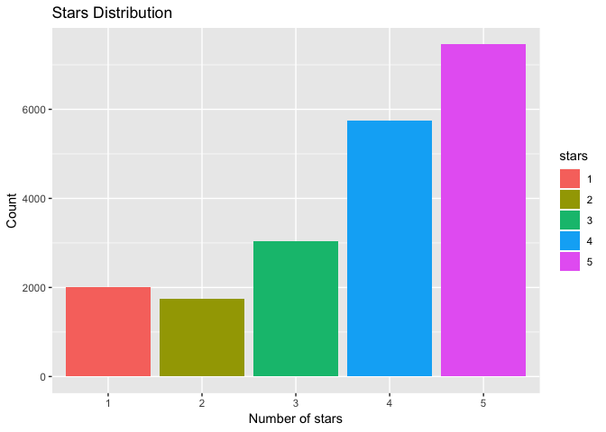
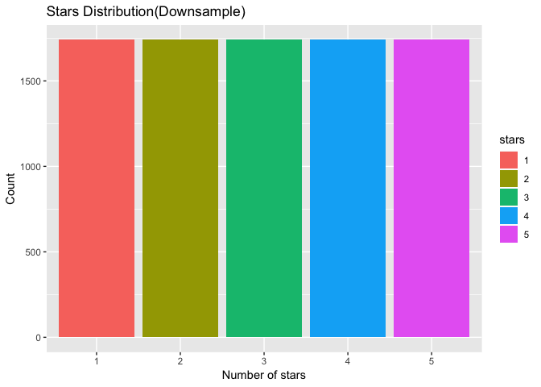
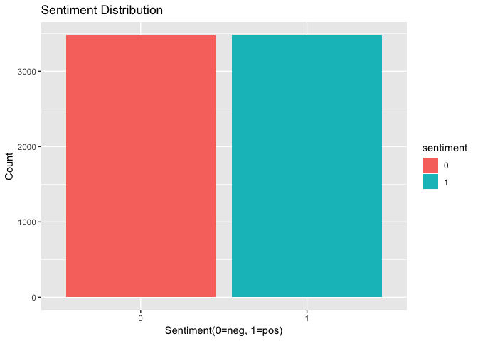
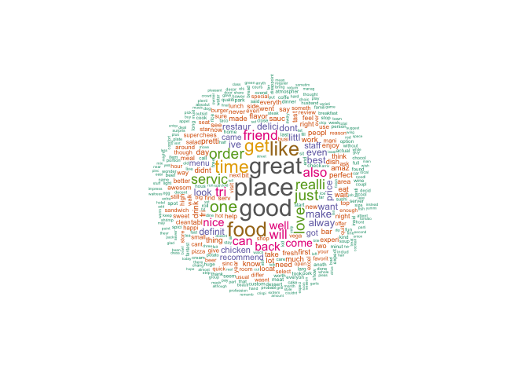
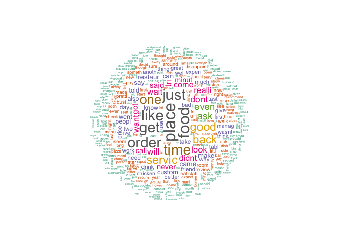
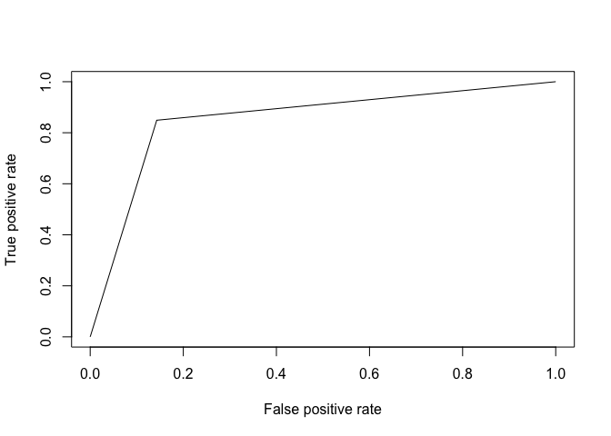
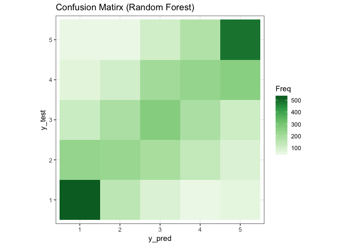
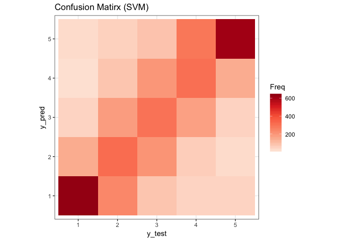

Yelp\_Reviews\_NLP
================

Data Preprocessing & Data Cleaning
==================================

Import Library
--------------

``` r
# data visualization
library(ggplot2)
library(wordcloud)
library(RColorBrewer)
library(ROCR)

# data processing
library(caret)
library(tm)
library(SnowballC)
library(NLP)
library(caTools)

# data modeling
library(e1071)
library(randomForest)
```

Import dataset and data overview
--------------------------------

``` r
reviews = read.csv('yelp_review.csv',stringsAsFactors=FALSE, header=T, nrows=20000)

dim(reviews)
```

    ## [1] 20000     9

``` r
names(reviews)
```

    ## [1] "review_id"   "user_id"     "business_id" "stars"       "date"       
    ## [6] "text"        "useful"      "funny"       "cool"

``` r
summary(reviews)
```

    ##   review_id           user_id          business_id            stars      
    ##  Length:20000       Length:20000       Length:20000       Min.   :1.000  
    ##  Class :character   Class :character   Class :character   1st Qu.:3.000  
    ##  Mode  :character   Mode  :character   Mode  :character   Median :4.000  
    ##                                                           Mean   :3.746  
    ##                                                           3rd Qu.:5.000  
    ##                                                           Max.   :5.000  
    ##      date               text               useful           funny        
    ##  Length:20000       Length:20000       Min.   : 0.000   Min.   : 0.0000  
    ##  Class :character   Class :character   1st Qu.: 0.000   1st Qu.: 0.0000  
    ##  Mode  :character   Mode  :character   Median : 1.000   Median : 0.0000  
    ##                                        Mean   : 1.635   Mean   : 0.6687  
    ##                                        3rd Qu.: 2.000   3rd Qu.: 1.0000  
    ##                                        Max.   :95.000   Max.   :51.0000  
    ##       cool        
    ##  Min.   : 0.0000  
    ##  1st Qu.: 0.0000  
    ##  Median : 0.0000  
    ##  Mean   : 0.7692  
    ##  3rd Qu.: 1.0000  
    ##  Max.   :70.0000

leave only the information we want to analyze (text and stars)
--------------------------------------------------------------

``` r
reviews = subset(reviews, select = c("text","stars"))
summary(reviews)
```

    ##      text               stars      
    ##  Length:20000       Min.   :1.000  
    ##  Class :character   1st Qu.:3.000  
    ##  Mode  :character   Median :4.000  
    ##                     Mean   :3.746  
    ##                     3rd Qu.:5.000  
    ##                     Max.   :5.000

See the distribution of the stars
---------------------------------

``` r
table(reviews$stars)
```

    ## 
    ##    1    2    3    4    5 
    ## 2004 1742 3044 5746 7464

``` r
reviews$stars = factor(reviews$stars, levels = c(1, 2, 3, 4, 5))
# distribution of stars
ggplot(data = reviews, aes(stars)) +
  geom_bar(aes(y = (..count..), fill = stars)) +
  ggtitle('Stars Distribution') + 
  xlab('Number of stars') +
  ylab("Count")
```



Use downsample function to deal with the class unbalance
--------------------------------------------------------

``` r
# downsample
set.seed(123)
reviews = downSample(x = reviews, y = reviews$stars)
```

``` r
table(reviews$stars)
```

    ## 
    ##    1    2    3    4    5 
    ## 1742 1742 1742 1742 1742

``` r
# distribution of stars
ggplot(data = reviews, aes(stars)) +
  geom_bar(aes(y = (..count..), fill = stars)) +
  ggtitle('Stars Distribution(Downsample)') + 
  xlab('Number of stars') +
  ylab("Count")
```



Only left pos and neg text(exclude the neutral)
-----------------------------------------------

``` r
pos = subset(reviews, as.numeric(stars) > 3)
neg = subset(reviews, as.numeric(stars) < 3)
reviews_sent = rbind(pos, neg)
```

create new dataset reviews\_sent to focus on binary sentiment analysis
----------------------------------------------------------------------

``` r
reviews_sent$sentiment[as.numeric(reviews_sent$stars) < 3] = 0
reviews_sent$sentiment[as.numeric(reviews_sent$stars) > 3] = 1

reviews_sent$sentiment = factor(reviews_sent$sentiment, levels = c(0, 1))
```

``` r
# distribution of sentiment
ggplot(data = reviews_sent, aes(sentiment)) +
  geom_bar(aes(y = (..count..), fill = sentiment)) +
  ggtitle('Sentiment Distribution') + 
  xlab('Sentiment(0=neg, 1=pos)') +
  ylab("Count")
```



Feature Selection
=================

clean the texts
---------------

``` r
# Cleaning the texts
cleantext = function(dataset){
  corpus = VCorpus(VectorSource(dataset$text))
  corpus = tm_map(corpus, content_transformer(tolower))
  corpus = tm_map(corpus, removeNumbers)
  corpus = tm_map(corpus, removePunctuation)
  corpus = tm_map(corpus, removeWords, stopwords())
  corpus = tm_map(corpus, stemDocument)
  corpus = tm_map(corpus, stripWhitespace)
  corpus
  return(corpus)
}
```

Create bag of words, and removeSparseTerms
------------------------------------------

``` r
# Creating the Bag of Words model
bagofwords = function(corpus){
  dtm = DocumentTermMatrix(corpus)
  dtm = removeSparseTerms(dtm, 0.99)
  dtm
  return(dtm)
}
```

Create wordcould
----------------

``` r
pos_text = cleantext(pos)
pos_words = bagofwords(pos_text)

m = as.matrix(pos_words)
v = sort(colSums(m),decreasing=TRUE)
d = data.frame(word = names(v),freq=v)
head(d, 10)
```

    ##        word freq
    ## place place 2182
    ## good   good 2053
    ## great great 1978
    ## food   food 1736
    ## like   like 1680
    ## time   time 1500
    ## get     get 1470
    ## one     one 1347
    ## just   just 1214
    ## order order 1206

``` r
set.seed(123)
wordcloud(words = d$word, freq = d$freq, scale=c(2,0.2),
          min.freq=sort(d$freq, decreasing=TRUE)[[400]],
          colors=brewer.pal(8, "Dark2"),
          random.order=FALSE) 
```



``` r
neg_text = cleantext(neg)
neg_words = bagofwords(neg_text)

m = as.matrix(neg_words)
v = sort(colSums(m),decreasing=TRUE)
d = data.frame(word = names(v),freq=v)
head(d, 10)
```

    ##          word freq
    ## place   place 2342
    ## food     food 2309
    ## like     like 2114
    ## just     just 2093
    ## get       get 2074
    ## order   order 2053
    ## time     time 2042
    ## one       one 1830
    ## servic servic 1650
    ## good     good 1634

``` r
set.seed(123)
wordcloud(words = d$word, freq = d$freq, scale=c(2,0.2),
          min.freq=sort(d$freq, decreasing=TRUE)[[400]],
          colors=brewer.pal(8, "Dark2"),
          random.order=FALSE) 
```



focus on sentiment column and remove stars column
-------------------------------------------------

``` r
reviews_sent = subset(reviews_sent, select = c("text", "sentiment"))
```

clean text and feature selection
--------------------------------

``` r
text = cleantext(reviews_sent)
words = bagofwords(text)

dataset = as.data.frame(as.matrix(words))
dataset$Sentiment = reviews_sent$sentiment
dim(dataset)
```

    ## [1] 6968  989

Fit the Model
=============

split into train set and test set
---------------------------------

``` r
set.seed(123)
split = sample.split(dataset$Sentiment, SplitRatio = 0.5)
train = subset(dataset, split == TRUE)
test = subset(dataset, split == FALSE)
```

Fit classification method
-------------------------

### Random forest

There are several reason I choose random forest as my classification method. 1) Random Forest is a powerful classification technique can handle both binary and multiclass classification. 2) It's the classification with high accuracy and fast training feature, which suitable for this large dataset. 3) Tree-based methods are more closely mirror human decision-making. I want to use it to present how our brain analyze the whether a text is positive or negative.

``` r
# Fitting Random Forest Classification to the Training set
classifier = randomForest(x = train[-989],
                          y = train$Sentiment,
                          ntree = 10)

# Predicting the Test set results
y_pred = predict(classifier, newdata = test[-989])

# Making the Confusion Matrix
cm = table(y_pred, y_test=test[, 989])
cm
```

    ##       y_test
    ## y_pred    0    1
    ##      0 1417  395
    ##      1  325 1347

``` r
accuracy = (1423+1364)/3484
precision = 1364 / (1364 + 319)
recall = 1364 / (1364 + 379)
accuracy
```

    ## [1] 0.7999426

``` r
precision
```

    ## [1] 0.8104575

``` r
recall
```

    ## [1] 0.7825588

The output of precision and recall can be valuable in different situation. When the customer what to make sure they find the good restaurant from the positive review. They would like to see high precision. If we want to find numbers of possible good restaurants based on reviews. We would like to have high recall. In the report, I focus on customer's perspective, would like to have higher precision, so I use the resampling method in the beginning, to balance the negative and positive reviews.

### SVM

Here I use the support vector machine as the second method. I didn't choose SVM in the beginning is because the dataset is too large to run SVM successfully, however, after I resize the dataset to a smaller size, SVM did a better job the random forest. After I reevaluate the method. I thought SVM can be a better algorithm based on the following reason. 1) Because of the bag of words would contains lots of feature, SVM is the algorithm which measures the complexity based on margin that separates the plane and not number of features. 2) Because the high sparsity feature, each of the document vectors contain only a few non-zero elements. Although it is high dimensionality, it is still linearly separable. So in the SVM function, we set the kernal as liner, and decrease the cost to increase the number of support vectors, and scale = FALSE to prevent the variables to be scaled.

``` r
classifier = svm(Sentiment ~ . , data=train, kernel="linear", cost=0.1, scale = FALSE)
summary(classifier)
```

    ## 
    ## Call:
    ## svm(formula = Sentiment ~ ., data = train, kernel = "linear", 
    ##     cost = 0.1, scale = FALSE)
    ## 
    ## 
    ## Parameters:
    ##    SVM-Type:  C-classification 
    ##  SVM-Kernel:  linear 
    ##        cost:  0.1 
    ##       gamma:  0.001012146 
    ## 
    ## Number of Support Vectors:  1335
    ## 
    ##  ( 666 669 )
    ## 
    ## 
    ## Number of Classes:  2 
    ## 
    ## Levels: 
    ##  0 1

``` r
y_pred = predict(classifier, newdata = test[-989])
cm = table(y_pred, y_test = test[, 989])
cm
```

    ##       y_test
    ## y_pred    0    1
    ##      0 1493  263
    ##      1  249 1479

``` r
accuracy = (1493+1479)/3484
precision = 1479 / (1479 + 249)
recall = 1479 / (1479 + 263)
accuracy
```

    ## [1] 0.8530425

``` r
precision
```

    ## [1] 0.8559028

``` r
recall
```

    ## [1] 0.8490241

``` r
pred1 = prediction(as.numeric(y_pred), as.numeric(test[, 989]))
perf1 <- performance(pred1,"tpr","fpr")
plot(perf1)
```



Multiclass classification
=========================

clean text and feature selection
--------------------------------

``` r
summary(reviews)
```

    ##      text           stars    Class   
    ##  Length:8710        1:1742   1:1742  
    ##  Class :character   2:1742   2:1742  
    ##  Mode  :character   3:1742   3:1742  
    ##                     4:1742   4:1742  
    ##                     5:1742   5:1742

``` r
text = cleantext(reviews)
words = bagofwords(text)

dataset = as.data.frame(as.matrix(words))
dataset$Stars = reviews$stars
```

Fit the Model
=============

split into train set and test set
---------------------------------

``` r
set.seed(123)
split1 = sample.split(dataset$Stars, SplitRatio = 0.5)
train = subset(dataset, split1 == TRUE)
test = subset(dataset, split1 == FALSE)
```

Fit classification method
-------------------------

### Random Forest

``` r
# Fitting Random Forest Classification to the Training set
# install.packages('randomForest')
classifier = randomForest(x = train[-993],
                          y = train$Stars,
                          ntree = 10)

# Predicting the Test set results
y_pred = predict(classifier, newdata = test[-993])

# Making the Confusion Matrix
cm = table(y_pred, y_test=test[, 993])
cm
```

    ##       y_test
    ## y_pred   1   2   3   4   5
    ##      1 526 234 118  68  54
    ##      2 148 226 187 102  53
    ##      3  83 194 269 205 106
    ##      4  53 134 187 237 172
    ##      5  61  83 110 259 486

``` r
confusion = as.data.frame(as.table(cm))

ggplot(confusion, aes(x=y_pred, y=y_test, fill=Freq)) + 
  geom_tile() + theme_bw() + coord_equal() +
  scale_fill_distiller(palette="Greens", direction=1) +
  ggtitle("Confusion Matirx (Random Forest)")
```



``` r
accuracy = (526+226+269+237+486)/4355
accuracy
```

    ## [1] 0.4004592

``` r
mse = sum((as.numeric(y_pred) - as.numeric(test[, 993]))**2)/length(y_pred)
mse
```

    ## [1] 1.917566

### Support Vector Machine

``` r
classifier = svm(Stars ~ . , data=train, kernel="linear", scale=FALSE, cost=0.01)
summary(classifier)
```

    ## 
    ## Call:
    ## svm(formula = Stars ~ ., data = train, kernel = "linear", cost = 0.01, 
    ##     scale = FALSE)
    ## 
    ## 
    ## Parameters:
    ##    SVM-Type:  C-classification 
    ##  SVM-Kernel:  linear 
    ##        cost:  0.01 
    ##       gamma:  0.001008065 
    ## 
    ## Number of Support Vectors:  3996
    ## 
    ##  ( 700 836 847 855 758 )
    ## 
    ## 
    ## Number of Classes:  5 
    ## 
    ## Levels: 
    ##  1 2 3 4 5

``` r
y_pred = predict(classifier, newdata = test[-993])
cm = table(y_pred, y_test = test[, 993])
cm
```

    ##       y_test
    ## y_pred   1   2   3   4   5
    ##      1 633 238  81  46  46
    ##      2 144 315 206  60  29
    ##      3  46 185 297 173  49
    ##      4  20  80 201 306 143
    ##      5  28  53  86 286 604

``` r
confusion = as.data.frame(as.table(cm))

ggplot(confusion, aes(x=y_test, y=y_pred, fill=Freq)) + 
  geom_tile() + theme_bw() + coord_equal() +
  scale_fill_distiller(palette="Reds", direction=1) +
  ggtitle("Confusion Matirx (SVM)")
```



``` r
accuracy = (633+315+297+306+604)/4355
accuracy
```

    ## [1] 0.4948335

``` r
mse = sum((as.numeric(y_pred) - as.numeric(test[, 993]))**2)/length(y_pred)
mse
```

    ## [1] 1.30884

Reflction and Inspiration
-------------------------

In the multiclass classification, we can see that, SVM still perform so much better than random forest classification no matter in accuracy or mse. There are actually lots of ways to improve the performance such as the Bigram or N-gram word tokenization, and also can tune the parameter to a better fit. ALso can apply some ordinal regression. However, because it is too time-consuming to run the high-dimensional dataset. The things I mentioned here did not include in the report.
